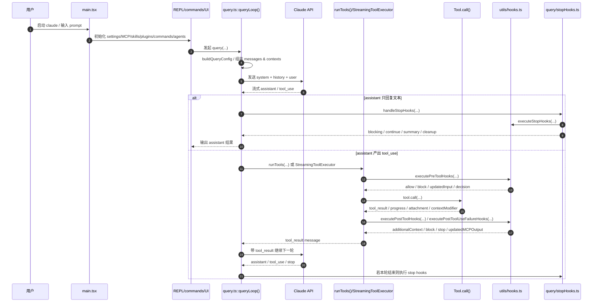
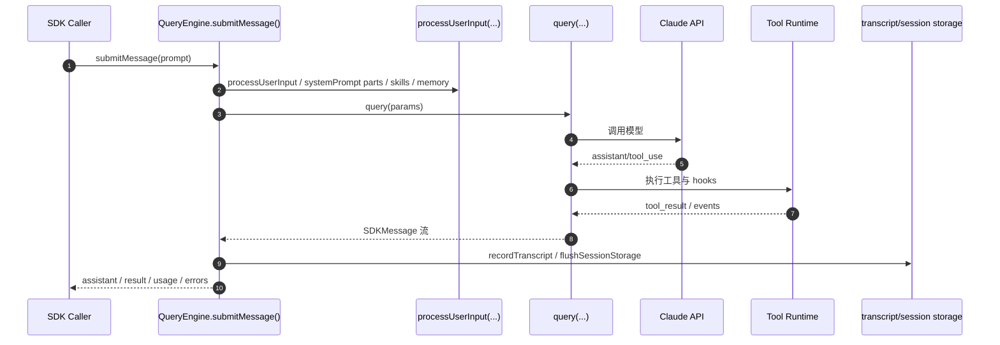
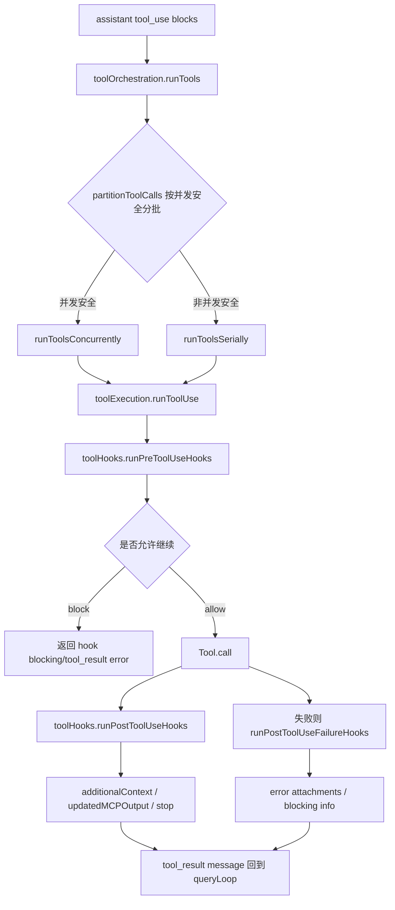
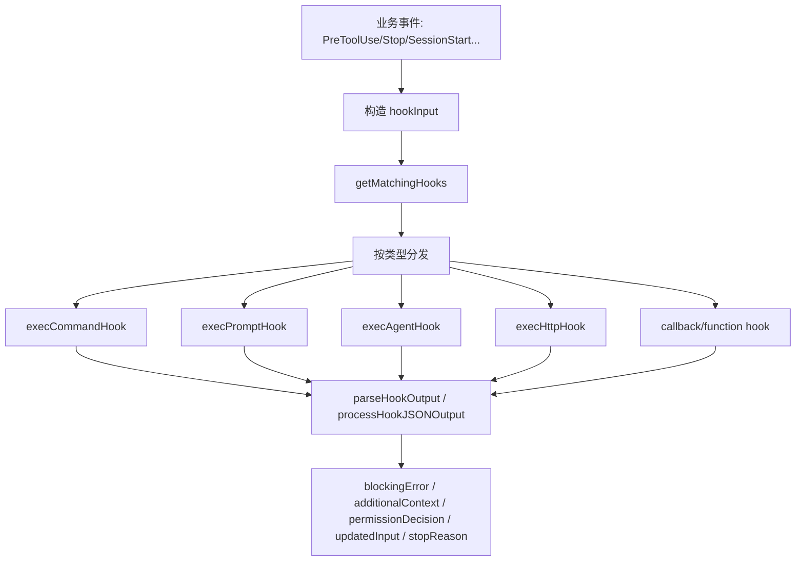
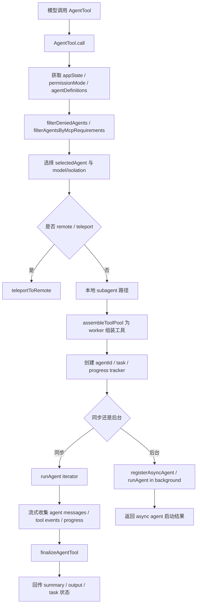

# Claude Code 主循环时序图 + Tool / Hook / Agent 调用链图

这一篇专门回答一个问题：

> **Claude Code 一轮 agent 行为，到底是怎么从“用户输入”一路跑到“模型输出 / 工具执行 / hook 处理 / stop 收尾 / 子代理协作”的？**

前面几篇已经把架构拆了，这篇就不再横着铺模块，而是**纵向走一遍调用链**。

---

## 1. 总体认识：Claude Code 不是“单次问答”，而是一个回合引擎

Claude Code 的一轮运行，本质上是这样：

1. 用户输入进入 REPL / SDK
2. 系统构建本轮 query 上下文
3. 调用模型
4. 如果模型产出 `tool_use`，进入工具调度
5. 工具执行前后触发 hooks
6. 工具结果回填到消息流
7. 继续 assistant → tool_use → tool_result 循环
8. 无工具或达到终点后执行 stop hooks
9. 做 prompt suggestion / memory extract / auto-dream / cleanup
10. 回合结束或继续下一轮

所以 Claude Code 的核心不是“一次模型请求”，而是：

> **一个多阶段、可中断、可扩展、带副作用管理的 agent turn runtime**

---

## 2. 主循环总时序图（REPL 路径）



---

## 3. SDK / headless 路径时序图

REPL 路径偏终端交互；SDK 路径则更像把运行时封进一个类里。



### 这里最重要的判断

`QueryEngine` 不是另起一套逻辑，而是：

- 复用 `query.ts`
- 复用 tools/hooks/session/transcript 能力
- 只是把交互式 REPL concerns 包起来，提供 SDK 风格接口

这说明 Claude Code 已经在做**runtime 与 UI 的部分解耦**。

---

## 4. 启动阶段调用链图

核心入口是：`main.tsx`

### 启动主线（逻辑图）

```text
main()
  -> 解析 CLI args / 模式 / flags
  -> eagerLoadSettings()
  -> runMigrations()
  -> initializeEntrypoint()
  -> 并行初始化：
       - commandsPromise
       - agentDefsPromise
       - mcpConfigPromise
       - setupPromise
       - hooksPromise
  -> 根据模式进入：
       - REPL / interactive
       - print/headless
       - SDK / remote / bridge
```

### 这一阶段的架构信号

1. `main.tsx` 很重，说明 Claude Code 不是轻 CLI
2. commands / agents / MCP / setup 是并行预热的，说明启动期非常产品化
3. hooks 在启动期就已经参与，不是纯 query 阶段才存在

---

## 5. Query 主循环调用链图

核心文件：`query.ts`

### 关键函数
- `query()`
- `queryLoop()`
- `yieldMissingToolResultBlocks()`
- `handleStopHooks()`（实际在 `query/stopHooks.ts`）

### Query 主循环（逻辑链）

```text
query()
  -> queryLoop()
      -> buildQueryConfig(...)
      -> normalize / prepend userContext / append systemContext
      -> 调用 Claude API（流式）
      -> 收集 assistant message / tool_use
      -> 如果有 tool_use:
           -> runTools(...) 或 StreamingToolExecutor
           -> 生成 tool_result messages
           -> 继续 queryLoop 下一轮
      -> 如果无 tool_use 或到达终点:
           -> handleStopHooks(...)
           -> 返回 Terminal / 结束本轮
```

### 这里最关键的事实

Claude Code 不是“模型说一句 → 程序执行一句”。

它是一个带状态的 loop：
- history 持续增长
- tool results 持续回填
- compact 可能触发
- fallback 可能触发
- stop hooks 可能阻断或延续
- token budget 会影响下一步行为

---

## 6. Tool 执行调用链图

核心文件：
- `Tool.ts`
- `tools.ts`
- `services/tools/toolOrchestration.ts`
- `services/tools/StreamingToolExecutor.ts`
- `services/tools/toolExecution.ts`
- `services/tools/toolHooks.ts`

---

### 6.1 工具池装配链

```text
tools.ts
  -> getAllBaseTools()
  -> getTools(permissionContext)
  -> filterToolsByDenyRules(...)
  -> assembleToolPool(permissionContext, mcpTools)
  -> 得到最终可见工具池
```

### 含义

工具不是散装注册，而是经过：
- feature gate
- deny rules
- 模式裁剪
- MCP 合并

才形成最终给模型看的工具池。

---

### 6.2 ToolUse 执行链



### 关键文件分工

#### `toolOrchestration.ts`
最重要函数：
- `runTools()`
- `partitionToolCalls()`
- `runToolsSerially()`
- `runToolsConcurrently()`

这层负责：
- 决定哪些工具可以并发
- 决定哪些工具必须独占
- 保证 contextModifier 应用时机正确

#### `StreamingToolExecutor.ts`
最重要方法：
- `addTool()`
- `processQueue()`
- `createSyntheticErrorMessage()`
- `getAbortReason()`

这层负责：
- 流式工具执行
- queued/executing/completed/yielded 状态机
- sibling error / user interrupt / streaming fallback 处理

#### `toolExecution.ts`
最重要函数：
- `classifyToolError()`
- `runToolUse()`（主执行入口，虽然上面这次截取没展开到定义，但整个文件就是围绕它组织）

这层负责：
- 单个 tool_use 的完整执行与结果包装
- permission / telemetry / storage / stop summary 等附加处理

---

## 7. Hook 调用链图

核心文件：`utils/hooks.ts`

### 7.1 Hook 解析与匹配链

```text
createBaseHookInput(...)
  -> getHooksConfig(...)
  -> getMatchingHooks(...)
      -> matcher / if condition / dedup / plugin/session hooks 合并
  -> 执行具体 hook
```

### 7.2 Hook 执行链



### 关键函数

- `createBaseHookInput()`
- `parseHookOutput()`
- `processHookJSONOutput()`
- `execCommandHook()`
- `getMatchingHooks()`
- `executePreToolHooks()`
- `executePostToolHooks()`
- `executePostToolUseFailureHooks()`
- `executeStopHooks()`
- `executeSessionStartHooks()`

### 最重要的判断

Claude Code 的 hooks 不是：
- 调个 shell 脚本
- 打个日志
- 最多 fail/pass

而是能真正回流控制主流程：
- 阻断工具
- 改写输入
- 加附加上下文
- 产出权限决策
- 改写 MCP 工具输出
- 停止继续执行

这也是它和普通“插件回调”最大的区别。

---

## 8. Stop 阶段调用链图

核心文件：`query/stopHooks.ts`

### 最重要函数
- `handleStopHooks()`

### Stop 阶段逻辑链

```text
handleStopHooks(...)
  -> 构造 stopHookContext
  -> saveCacheSafeParams(...)
  -> 执行模板/任务状态写入（特定 feature 下）
  -> fire-and-forget:
       - executePromptSuggestion(...)
       - executeExtractMemories(...)
       - executeAutoDream(...)
  -> executeStopHooks(...)
  -> 收集：
       - progress messages
       - hook success / non-blocking error / blocking error
       - preventContinuation / stopReason
  -> 生成 stop summary / blocking userMessage / interruption message
  -> 返回给 queryLoop
```

### 这一层的意义

很多人会把“assistant 本轮说完了”当成结束。

Claude Code 不是。

它把 stop 当成一个正式阶段，用来做：
- 生命周期收尾
- 自动记忆提取
- prompt suggestion
- 任务/teammate 完成态通知
- 清理 computer-use / background bookkeeping

也就是说：

> Claude Code 的“一轮结束”本身就是一个子系统。

---

## 9. Agent / Subagent 调用链图

核心文件：`tools/AgentTool/AgentTool.tsx`

### 关键导出与关键点
- `getAutoBackgroundMs()`
- `inputSchema`
- `outputSchema`
- `AgentTool = buildTool({...})`
- `call()`（AgentTool 最核心逻辑）

### AgentTool 主链



### 这条链说明了什么

Claude Code 的 subagent 不是 prompt hack，而是正式 runtime：

- 有正式工具入口 `AgentTool`
- 有 agent type / agent model / isolation / remote / worktree
- 有 background task / foreground task
- 有 progress / task registration / output file
- 有 hook 和 permission 上下文继承

这已经不是“让模型扮演另一个人”，而是：

> **把“启动另一个代理”当成一级工具能力**

---

## 10. 一条完整的“带工具 + hooks + subagent”的调用链

下面给一个最典型、也最有代表性的完整链：

```text
用户输入
  -> main.tsx / REPL
  -> query.ts::queryLoop()
  -> Claude API 返回 assistant + tool_use(AgentTool)
  -> runTools()
  -> runToolUse()
  -> runPreToolUseHooks()
  -> AgentTool.call()
      -> 选 agent / model / isolation
      -> assembleToolPool(worker)
      -> runAgent(...)
      -> 子代理内部再次跑 query/runtime
      -> 子代理产出消息/工具结果/summary
  -> runPostToolUseHooks()
  -> tool_result 回填到主 query loop
  -> 主 assistant 基于 agent 结果继续回答
  -> handleStopHooks()
  -> executeStopHooks()
  -> prompt suggestion / memory extract / auto-dream / cleanup
  -> 本轮结束
```

这条链非常能体现 Claude Code 的产品特征：
- 主循环不是单层
- 工具内部还能再启动 agent runtime
- hooks 横切整个生命周期
- stop 阶段还有后台收尾任务

---

## 11. 为什么 Claude Code 的主循环难抄但值得抄

### 难抄的原因

1. **横切 concern 太多**
   - permissions
   - hooks
   - telemetry
   - transcript
   - compact
   - background tasks
   - MCP
   - state

2. **不是单文件逻辑**
   主循环分散在：
   - `main.tsx`
   - `query.ts`
   - `QueryEngine.ts`
   - `services/tools/*`
   - `utils/hooks.ts`
   - `query/stopHooks.ts`
   - `tools/AgentTool/*`

3. **有大量 feature gate**
   你看到的是“成熟产品生长后的 runtime”，不是最小实现。

### 值得抄的原因

1. 它非常真实地回答了“agent 产品真正会遇到什么问题”
2. 它展示了如何把 hooks 做成正式生命周期协议
3. 它展示了如何把 subagent 做成正式工具能力
4. 它展示了如何把 stop 阶段从“尾巴”升格成“阶段”
5. 它展示了工具并发、可中断、可回填上下文的产品化做法

---

## 12. 如果你只想抓主线，最该读哪几个函数

### 第一梯队：核心中的核心

1. `query.ts::queryLoop()`
2. `services/tools/toolOrchestration.ts::runTools()`
3. `services/tools/StreamingToolExecutor.ts::processQueue()`
4. `utils/hooks.ts::getMatchingHooks()`
5. `utils/hooks.ts::execCommandHook()`
6. `query/stopHooks.ts::handleStopHooks()`
7. `tools/AgentTool/AgentTool.tsx::AgentTool.call()`

### 第二梯队：补上下文

8. `Tool.ts::buildTool()`
9. `tools.ts::assembleToolPool()`
10. `utils/hooks.ts::processHookJSONOutput()`
11. `QueryEngine.ts::submitMessage()`
12. `main.tsx::main()`

---

## 13. 最终结论

如果用一句话总结 Claude Code 的主循环：

> **它不是“LLM + tools”，而是“带生命周期 hooks、工具编排、stop 收尾、subagent 嵌套执行、MCP/skills/plugins 扩展能力的多阶段回合引擎”。**

而这篇图里最重要的 4 个点是：

1. **`queryLoop()` 是主心脏**
2. **Tool execution 是一个独立编排层，不是 query 的小分支**
3. **Hooks 横切整个生命周期，并且能回流控制逻辑**
4. **AgentTool 让“启动另一个 agent”成为正式工具能力**

这也是 Claude Code 最值得被拆、最值得被学的地方。
