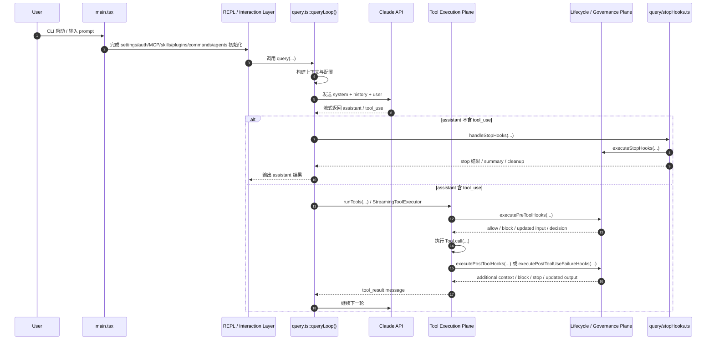
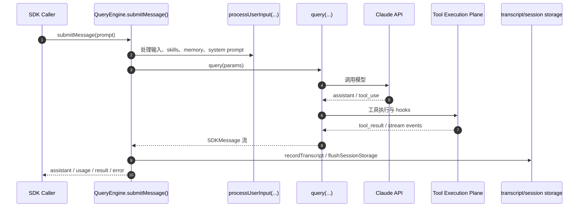
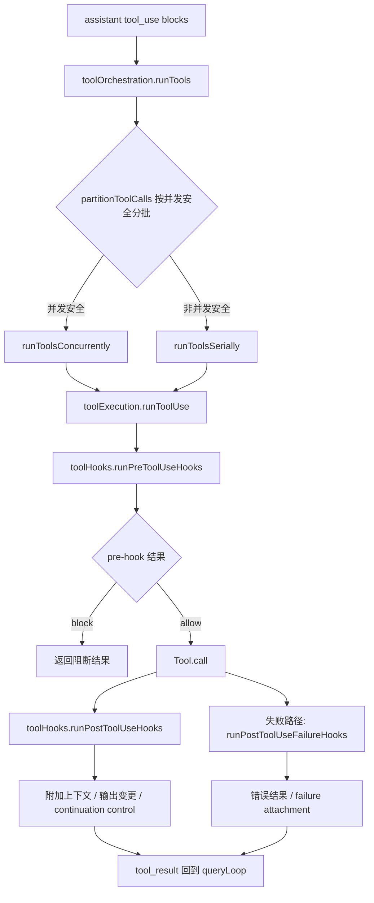
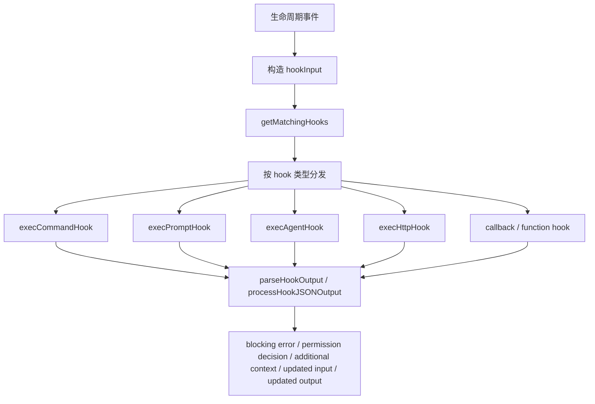
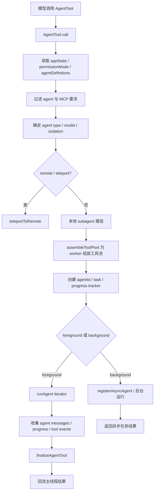

# 主循环时序与调用链

## 1. REPL 路径总时序



---

## 3. SDK / headless 路径时序

SDK / headless 路径并未实现一套完全独立的运行时，而是在不同交互承载方式下复用主运行时语义。



---

## 4. 启动阶段调用链

启动阶段的主要职责是完成装配，而非推进业务主流程。

### 调用链摘要

```text
main()
 -> 解析 CLI 参数
 -> eagerLoadSettings()
 -> runMigrations()
 -> initializeEntrypoint()
 -> 并行初始化 commands / agents / MCP / setup / hooks
 -> 进入 REPL / headless / SDK / remote 路径
```

### 说明
启动阶段是 Composition Root。其关注点在于：
- 初始化顺序
- 运行模式选择
- 扩展和能力的预热与装配

---

## 5. Query 主循环调用链

核心文件：`query.ts`

### 关键函数
- `query()`
- `queryLoop()`
- `yieldMissingToolResultBlocks()`

### 逻辑链

```text
query()
 -> queryLoop()
 -> buildQueryConfig(...)
 -> 构造 messages / contexts
 -> 调用模型
 -> 收集 assistant messages / tool_use
 -> 若存在 tool_use:
 -> 进入 Tool Execution Plane
 -> 生成 tool_result 并回填消息流
 -> 继续 queryLoop 下一轮
 -> 若本轮进入结束条件:
 -> 进入 stop 阶段
 -> 返回 terminal result
```

### 说明
Query 主循环的职责不是执行工具，而是控制一轮会话如何推进：
- 何时请求模型
- 何时执行工具
- 何时进入下一轮
- 何时执行 stop 阶段
- 何时触发 compact 或 fallback

---

## 6. Tool 执行调用链

核心文件：
- `Tool.ts`
- `tools.ts`
- `services/tools/toolOrchestration.ts`
- `services/tools/StreamingToolExecutor.ts`
- `services/tools/toolExecution.ts`
- `services/tools/toolHooks.ts`

### 6.1 工具池形成路径

```text
tools.ts
 -> getAllBaseTools()
 -> getTools(permissionContext)
 -> filterToolsByDenyRules(...)
 -> assembleToolPool(permissionContext, mcpTools)
 -> 得到最终工具池
```

### 6.2 工具执行路径



### 关键点
- `toolOrchestration.ts` 负责分批与并发控制
- `StreamingToolExecutor.ts` 负责流式到达场景下的状态机
- `toolExecution.ts` 负责单个 tool_use 的完整执行语义
- `toolHooks.ts` 负责工具层与治理层的连接

---

## 7. Hook 调用链

核心文件：`utils/hooks.ts`

### 7.1 匹配路径

```text
createBaseHookInput(...)
 -> getHooksConfig(...)
 -> getMatchingHooks(...)
 -> 过滤 matcher / if 条件 / session hooks / plugin hooks / 去重
```

### 7.2 执行路径



### 关键点
- hook 的输入是事件协议的一部分
- hook 的匹配逻辑与执行逻辑分离
- hook 输出并非仅用于记录，而是可回流影响主流程

---

## 8. Stop 阶段调用链

核心文件：`query/stopHooks.ts`

### 关键函数
- `handleStopHooks()`

### 逻辑链

```text
handleStopHooks(...)
 -> 构造 stopHookContext
 -> saveCacheSafeParams(...)
 -> 执行 stop hooks
 -> 收集 blocking / preventContinuation / summary / progress
 -> 启动回合结束阶段的后台动作
 - prompt suggestion
 - extract memories
 - auto-dream
 - cleanup
 -> 将结果回流 Query Runtime
```

### 说明
Stop 阶段在 目标系统 中是正式生命周期阶段，而不是 query loop 的简单尾部操作。

---

## 9. Agent / Subagent 调用链

核心文件：`tools/AgentTool/AgentTool.tsx`

### 关键入口
- `AgentTool = buildTool({...})`
- `call()`
- `getAutoBackgroundMs()`

### 调用链



### 说明
subagent 在系统中并不是普通函数调用，而是新的运行时上下文。其执行过程具备独立的：
- agentId
- tool pool
- task 状态
- 权限上下文
- 前后台模式
- 结果收口方式

---

## 10. 端到端调用链示例

以下是一条典型的端到端路径：

```text
用户输入
 -> main.tsx / REPL
 -> query.ts::queryLoop()
 -> Claude API 返回 assistant + tool_use
 -> runTools()
 -> runToolUse()
 -> runPreToolUseHooks()
 -> Tool.call()
 -> runPostToolUseHooks()
 -> tool_result 回填消息流
 -> 主循环继续或结束
 -> handleStopHooks()
 -> executeStopHooks()
 -> prompt suggestion / extract memories / cleanup
 -> 本轮结束
```

若该工具为 `AgentTool`，则在 `Tool.call()` 内部会进一步启动 subagent runtime，并在完成后再回流主线程。

---

## 11. 主要控制权分布

从调用链角度，可明确以下控制权分布：

- **主流程推进权**：`query.ts` / `QueryEngine.ts`
- **工具执行权**：`services/tools/*`
- **生命周期治理权**：`utils/hooks.ts`
- **回合结束收口权**：`query/stopHooks.ts`
- **多代理协作启动权**：`tools/AgentTool/*`

这一分布说明 目标系统 在架构上较清晰地区分了“控制”“执行”“治理”“协作”。

---

## 12. 结论

目标系统 的主循环不是单次模型请求的简单封装，而是一套多阶段回合执行结构：

1. Query Runtime 负责推进主流程
2. Tool Plane 负责执行工具能力
3. Hook Plane 负责对生命周期施加治理
4. Stop 阶段负责回合结束的统一收口
5. AgentTool 将多代理执行纳入同一运行时框架

因此，理解 目标系统 的关键不在单一模块，而在于这些调用链如何协同构成统一的运行时语义。